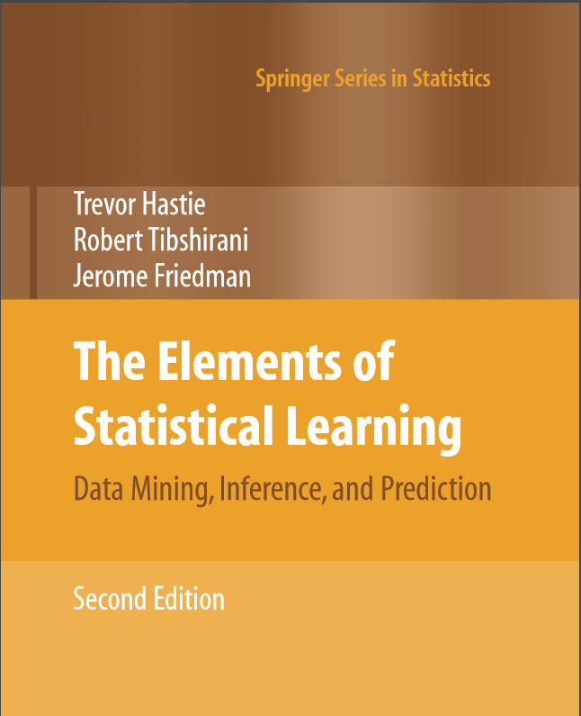

# elements-statistical-learning-notes

Summary notes and examples for every chapter in the popular textbook "The Elements of Statistical Learning" by Trevor Hastie, Robert Tibshirani, and Jerome Friedman.

These Jupyter notebooks are meant to assist with study by summarizing the key points of each chapter, and by providing some code examples to support the text.

Further, they serve as useful reference material for the machine learning practitioner whenever a quick refresh or inspiration is needed on a particular topic.

 

**Instructions:**

* Create a new Python 3 virtual environment.
* Activate your virtual environment and `pip install -r requirements.txt` (included in this repo).
* Run the `jupyter lab` command in your activated virtual environment.